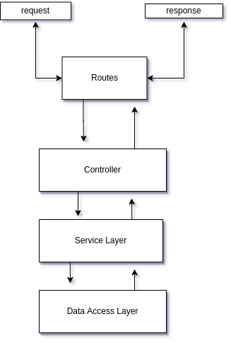
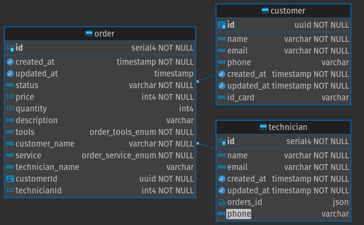

# service-orders-api

### Requirements

- Nodejs v12.13.x
- NPM 7.1x.x
- postgres

### Build

- Develop installation

```
1. Download repository.
2. Run command npm install on project root.
3. Run command docker-compose up (or up -d for detached).
4. make request on 8080.
5. Postgres binding port: 5432
```

- Install dependencies

  ```
  npm install
  ```

- Run locally

  ```
  npm run dev
  ```

### Postman Collection

[Postman📖](https://documenter.getpostman.com/view/8141743/UyxeqUSD)


### Scaffolding



### Schemas


***public link***
- https://infinite-chamber-01036.herokuapp.com/
### Contributors

- Edwin Manyoma

